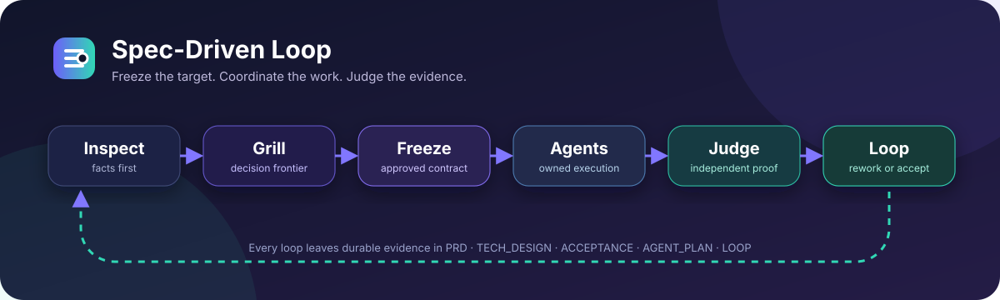

# Spec-Driven Loop

[简体中文](README.md) · [English](README.en.md)



[](https://github.com/Linji-x/spec-driven-loop/releases/latest)
[](https://github.com/Linji-x/spec-driven-loop/actions/workflows/validate.yml)
[](LICENSE)
[](https://github.com/Linji-x/spec-driven-loop/stargazers)
[](https://github.com/Linji-x/spec-driven-loop/commits/main)

**先冻结规格，再并行开发；由主 Agent 用证据独立裁判。**

Spec-Driven Loop 是一个面向 Codex 的开发 Skill。它把模糊的中大型软件需求变成可批准的 PRD、技术设计与验收合同，再组织 Agent 实现，并由主 Agent 独立验证结果。聊天可以中断，`LOOP.md` 仍能让工作从证据和下一步继续。

## 30 秒安装

在 Codex 中调用内置的 Skill Installer：

```text
$skill-installer Install https://github.com/Linji-x/spec-driven-loop/tree/v1.0.0/spec-driven-loop
```

然后直接调用：

```text
$spec-driven-loop 为运营团队开发一个支持筛选、分页和权限控制的 Job Dashboard
```

Codex 通常会自动发现新 Skill；如果 `$spec-driven-loop` 没有出现，再重启 Codex。安装与发现行为以 [OpenAI Skills 文档](https://developers.openai.com/codex/skills)为准。

## 它解决什么问题

很多 AI 开发失败，不是代码写不出来，而是需求、接口和“完成”的定义一直在移动：

- 产品选择被 Agent 当成事实自行猜测；
- 多个 Agent 在共享接口未冻结时同时修改，最后难以集成；
- 子 Agent 报告“完成”就被当成验收通过；
- 聊天中断后，没人知道当前证据、缺口和下一步；
- 发现需求变更时仍继续补代码，导致返工越来越大。

Spec-Driven Loop 用五份可审计文档和一个闭环把这些问题显式化：

| 产物 | 权威职责 |
| --- | --- |
| `PRD.md` | 为什么做、为谁做、产品行为与业务规则 |
| `TECH_DESIGN.md` | 架构、接口、数据、安全与运维设计 |
| `ACCEPTANCE.md` | 每项需求如何以可观察证据判定通过或失败 |
| `AGENT_PLAN.md` | 依赖顺序、文件所有权、任务合同和验证命令 |
| `LOOP.md` | 当前状态、每轮证据、主 Agent 裁决、返工与下一步 |

## 完整闭环

```text
Inspect ──► Grill ──► Freeze ──► Agents ──► Judge
   ▲                                               │
   └──────────────── Loop / Rework ◄───────────────┘
```

1. **Inspect**：先读仓库、架构、接口、测试和项目约定，能查到的事实不反问用户。
2. **Grill**：只追问真正影响产品或关键技术路线的决定；每轮 1–3 个当前可回答的前沿问题。
3. **Freeze**：冻结 PRD、技术设计和验收合同，获得明确批准后才修改生产代码。
4. **Agents**：冻结共享接口，按依赖和非重叠文件所有权分配实现任务；重叠工作串行化。
5. **Judge**：主 Agent 自己检查 diff、运行验证、对照验收矩阵，不把子 Agent 自报完成当作结论。
6. **Loop**：代码缺陷进入定向返工；需求变化则退回规格、重新批准，再继续实现。

> 不具备子 Agent 能力时仍可使用：主 Agent 按同一 `AGENT_PLAN.md` 串行执行，验收标准不降低。

## 适用场景

适合：

- 新产品、跨模块功能或中大型重构；
- 需要 PRD、技术设计、验收标准和可恢复执行记录；
- 涉及多个 Agent、共享接口、迁移、权限或高返工风险；
- 希望把“完成”从主观报告变成可复核证据。

不适合：

- 单文件小改、微小 Bug、纯解释或只读代码审查；
- 单纯调研、一次性脚本或已经完整冻结的简单任务；
- 你只想快速生成代码，不愿确认规格和验收边界。

## 使用方式

### 从模糊需求开始

```text
$spec-driven-loop 为现有 SaaS 增加团队邀请、角色权限和成员审计日志
```

Skill 会先检查现状并产出规格草案，再将真正需要你决定的问题逐轮提出。你明确批准冻结的规格和验收合同后，才进入实现。

### 从已有规格继续

```text
$spec-driven-loop 读取 docs/spec-driven/team-invites/，检查已批准的规格并从 LOOP.md 当前状态继续
```

如果权威文档仍适用，它会从计划或当前循环继续，而不是重新询问已经解决的问题。

### 要求严格验收

```text
$spec-driven-loop 对本轮交付做主 Agent 独立验收；逐项给出 AC、证据、结果和缺口，不接受 Agent 自报完成
```

## 完整演示：Job Dashboard

[匿名合成案例](examples/job-dashboard/README.md)展示了一个 Job Dashboard 如何从需求冻结走到最终验收。案例包含：

- [PRD](examples/job-dashboard/PRD.md)
- [技术设计](examples/job-dashboard/TECH_DESIGN.md)
- [验收合同](examples/job-dashboard/ACCEPTANCE.md)
- [Agent 计划](examples/job-dashboard/AGENT_PLAN.md)
- [执行循环](examples/job-dashboard/LOOP.md)
- 最终验收矩阵与真实形式的测试证据

这是基于已完成前向测试整理的匿名合成示例，不包含真实客户、账号或私有代码。

## 其他安装方式

### 手动安装

将仓库中的 `spec-driven-loop/` 复制到官方用户级 Skill 目录：

```text
$HOME/.agents/skills/spec-driven-loop
```

`spec-driven-loop/` 始终是本仓库的权威、可独立安装版本。

### Plugin（Preview）

仓库也提供 Plugin 形态，适合已经支持 Plugin Marketplace 的 Codex 版本：

```text
codex plugin marketplace add Linji-x/spec-driven-loop --ref v1.0.0
```

添加 Marketplace 后，从桌面端 **Plugins Directory** 安装 **Spec-Driven Loop**。当前维护者的本机 CLI 尚未暴露 `codex plugin` 命令，因此这条路径标记为 **Preview**，不是首选安装方式，也不宣称已在所有环境端到端验证。Plugin 结构遵循 [OpenAI Plugin 打包文档](https://developers.openai.com/plugins/build/plugins)。

Plugin 中的 Skill 是权威目录的自动镜像；CI 会阻止两份内容不一致。

## 升级与卸载

- 升级：重新运行稳定版安装命令，或下载 [最新 Release](https://github.com/Linji-x/spec-driven-loop/releases/latest) 的压缩包替换旧目录。
- 固定版本：安装 URL 中保留 `tree/v1.0.0`；需要新版本时显式切换 tag。
- 卸载：删除 `$HOME/.agents/skills/spec-driven-loop`。Plugin 用户可在 Plugins Directory 中卸载。

## FAQ

<details>
<summary><strong>它是不是要求每个项目都使用多个 Agent？</strong></summary>

不是。Agent 协作是一种执行方式，不是依赖。没有子 Agent 时，主 Agent 串行执行同一个计划，仍然保持规格冻结、文件所有权和独立验收。
</details>

<details>
<summary><strong>为什么不让 Agent 直接写代码？</strong></summary>

中大型需求的高成本错误通常来自边界和接口判断，而不是输入速度。冻结规格让实现和验收拥有同一个稳定目标；小改动本来就不应使用这个 Skill。
</details>

<details>
<summary><strong>“Grill” 是否依赖其他 Skill？</strong></summary>

不依赖。提问方法受到 Matt Pocock 的 MIT 许可 `grill-me` / `grilling` 决策树与 frontier 方法启发，但所需流程已包含在本 Skill 中。
</details>

<details>
<summary><strong>中断后怎么恢复？</strong></summary>

再次调用 Skill，并让它读取对应目录的 `LOOP.md`。权威文档记录了冻结状态、证据、裁决、未解决风险和下一步。
</details>

<details>
<summary><strong>为什么不会自动触发？</strong></summary>

它有明确的规格审批门槛，且不适合小任务，因此设置为只显式调用。请使用 `$spec-driven-loop ...`。
</details>

## 贡献

Bug、改进建议和真实使用案例都很有价值。提交前请阅读 [CONTRIBUTING.md](CONTRIBUTING.md)：

- Bug 请带上 Codex 版本、触发方式、预期/实际行为和可公开的 `LOOP.md` 片段；
- Feature 请说明它解决哪类失败模式，以及是否改变冻结、协作或验收语义；
- 修改权威 Skill 后运行同步和验证，确保 Plugin 镜像一致。

欢迎在 [Discussions](https://github.com/Linji-x/spec-driven-loop/discussions) 分享工作流、提问或展示交付案例。

## Roadmap

- 收集更多真实、可匿名复现的交付案例；
- 根据社区反馈改进规格问题树和验收证据模板；
- 在更多支持 Plugin Marketplace 的 Codex 环境完成端到端验证；
- 30 天争取 100 Star —— 这是透明的运营目标，不是结果承诺。

## License 与致谢

[MIT License](LICENSE)。需求澄清方法受到 Matt Pocock 的 MIT 许可 `grill-me` / `grilling` 工作启发；本项目对其进行了面向规格冻结、Agent 协作和独立验收的重新设计。

如果这个闭环帮你避免过一次昂贵返工，欢迎点一个 ⭐，也欢迎把真实问题带到 Discussion。真实使用反馈比任何刷量都更有价值。
